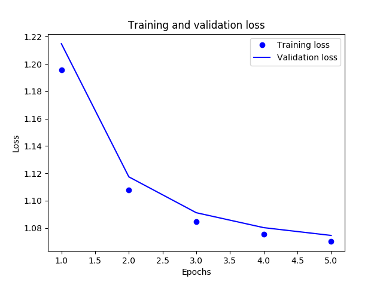

# Deep-Learning-NN-from-scratch
This repository has modules which will simulate a 3-layer NN. The modules are built from scratch without using any GPU framework library. Simulations include forward and backward propagation for every node of sigmoid/softmax activiation.

3-layer architecture created here: Layer 1: Sigmoid (255)
                                   Layer 2: Sigmoid (16)
                                   Layer 3: Softmax (3)

Example used: cifar-10 dataset filtered down to 3 classes

Categorical cross entropy used as loss function.

Weights initialisation is random.

Performance:
This is purely an academic exercise. The purpose is to understand how NN work internally. This will come in useful if a custom GPU framework is to be built. The code, obviously, is time inefficient as compared to a standard GPU library. However, it is a functional system capable of learning and if left to execute, will converge to similar results as compared to a similar NN built using a GPU framework.

Training results plot(5 epochs):

